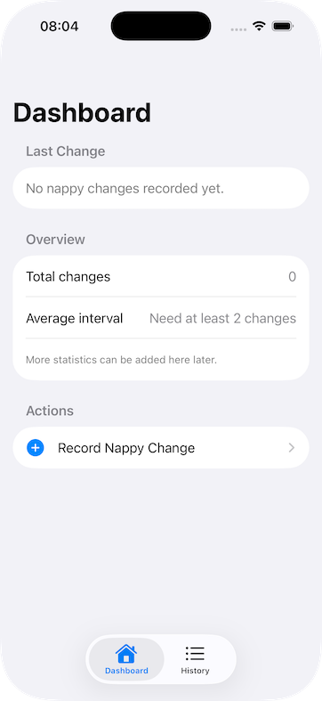
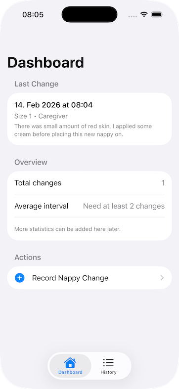
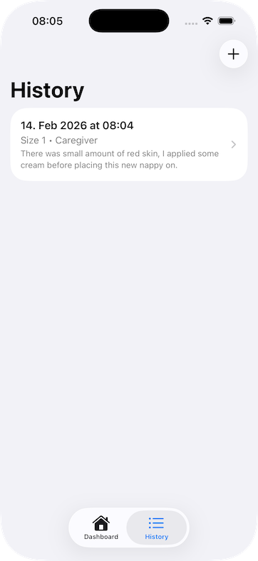
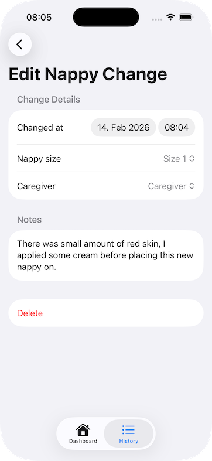

# NappyChangeTracker

## Screenshots

| Dashboard (Initial) | Dashboard (After Log) |
| --- | --- |
|  |  |

| History | Edit Form |
| --- | --- |
|  |  |

NappyChangeTracker is a SwiftUI iOS project for recording and reviewing baby nappy changes.

The app currently supports:
- Recording nappy changes with date/time, size, caregiver role, and notes
- Backdating entries (recording historical changes)
- Editing and deleting existing entries
- Viewing a dashboard and full history list (newest first)

This repository is intended as a foundation for open-source contributors and future App Store release work.

## Goals

- Keep the codebase simple, explicit, and safe under Swift 6 concurrency
- Make features easy to extend without rewriting core flow
- Provide a predictable architecture that contributors can follow

## Architecture Decisions

This project intentionally favours long-term maintainability over short-term convenience:

- **Scene-owned navigation** keeps routes in one place per flow, so feature changes do not scatter navigation logic across views.
- **View/ViewModel separation** keeps rendering and business behaviour independent, which improves readability and change safety.
- **Protocol-backed services** make persistence replaceable without rewriting screens or view models.
- **Actor-backed mutable state** provides a clear concurrency boundary for data mutations.
- **AsyncStream-driven updates** keeps UI state in sync with service state while preserving asynchronous, testable APIs.

## Current Architecture

The app follows a lightweight layered approach:

- `Models/`: domain data structures (`NappyChange`, `NappyChangeDraft`, etc.)
- `Services/`: data access and persistence abstractions (`NappyChangeServiceProtocol`) and implementations (`InMemoryNappyChangeService`)
- `ViewModels/`: state orchestration for each screen
- `Views/`: UI components and forms
- `Scenes/`: navigation owners (`NavigationStack` + destinations)
- `ContentView`: single app `TabView` root

### Why it is structured this way

- **Single navigation ownership per flow**: each `*Scene` controls its own destinations, reducing hidden routing logic.
- **Views stay UI-focused**: user interactions call ViewModel methods; ViewModels coordinate service calls.
- **Actor-backed service layer**: mutable data lives in an actor for concurrency safety.
- **Protocol-backed dependencies**: service contracts are defined via protocols so storage can be swapped later.
- **Async stream updates**: UI stays reactive to data changes through `AsyncStream<[NappyChange]>`.

## App Flow

- App entry: `NappyChangeTrackerApp`
- Root tabs: `ContentView`
  - `DashboardScene` -> `DashboardView`
  - `HistoryScene` -> `NappyChangeHistoryView`
- Editor route: `NappyChangeEditorMode` (`create` / `edit(UUID)`)

## Data Flow

1. A View initialises its ViewModel.
2. The ViewModel receives a service dependency (`NappyChangeServiceProtocol`).
3. ViewModels observe `stream()` for live updates.
4. Create/edit/delete operations call async service methods.
5. Service publishes updated snapshots back through the stream.

## Project Conventions

This project intentionally follows strict conventions:

- Swift 6 code only
- One `TabView` in the app root
- Scene-based navigation ownership
- Explicit access control
- No business logic inside Views
- Form editing UX includes save/reset/delete behaviour
- Service dependencies passed through protocols

## Continuing the Pattern

When adding a new feature, follow this order:

1. Add or update domain model in `Models/`.
2. Extend service protocol with required operations.
3. Implement service behaviour in actor-backed service.
4. Add a ViewModel focused on state + actions.
5. Add Views for UI only.
6. Register navigation in the owning `*Scene`.

### Example: adding analytics

- Add a `Statistics` model in `Models/`
- Add `fetchStatistics()` to `NappyChangeServiceProtocol`
- Implement it in `InMemoryNappyChangeService` (and future persistent service)
- Add `StatisticsViewModel`
- Present data in a new View from `DashboardScene`

## Persistence Roadmap

Current storage is in-memory for rapid iteration.

Recommended next step:
- Add a persistent service implementation (for example file-backed JSON or database-backed storage)
- Keep `NappyChangeServiceProtocol` stable and switch `AppServiceContainer` wiring

This keeps UI and ViewModels unchanged while persistence evolves.

## Build & Run

- Open `NappyChangeTracker.xcodeproj` in Xcode
- Select scheme: `NappyChangeTracker`
- Use simulator: `iPhone 17 Pro`
- Build and run

CLI build:

```bash
xcodebuild -project NappyChangeTracker.xcodeproj \
  -scheme NappyChangeTracker \
  -destination 'platform=iOS Simulator,name=iPhone 17 Pro' build
```

## Previews Troubleshooting

If SwiftUI previews fail with JIT object-file permission errors:

- Reset custom Xcode build locations to defaults
- Ensure DerivedData/Intermediates are under:
  - `~/Library/Developer/Xcode/DerivedData`
- Clean build folder and restart Xcode

## Contributing

Contributions are welcome. Please keep PRs focused and architecture-consistent:

- Keep one responsibility per file/type
- Avoid introducing alternative navigation patterns in the same flow
- Prefer extending existing service and ViewModel layers over view-level shortcuts
- Preserve concurrency safety (actors, async APIs, cancellation checks)

## Near-Term Backlog

- Persistent storage implementation
- Export/import support
- Richer dashboard statistics
- Basic test suite for services and ViewModels
- Accessibility and localisation pass
- Privacy policy + release prep for App Store distribution
